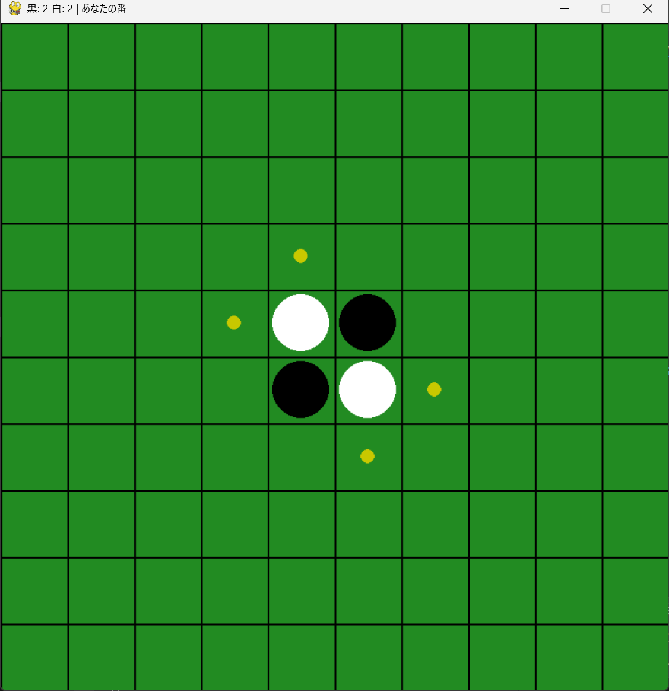
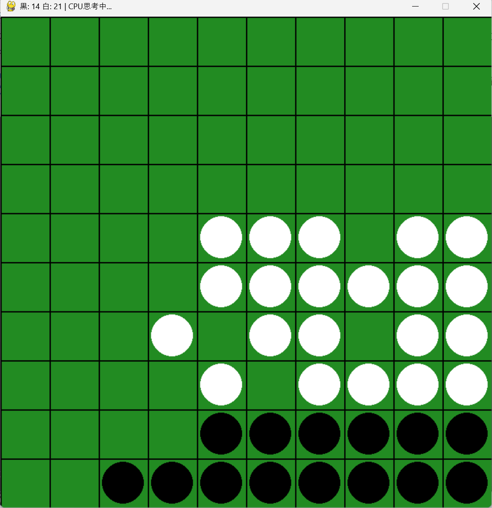
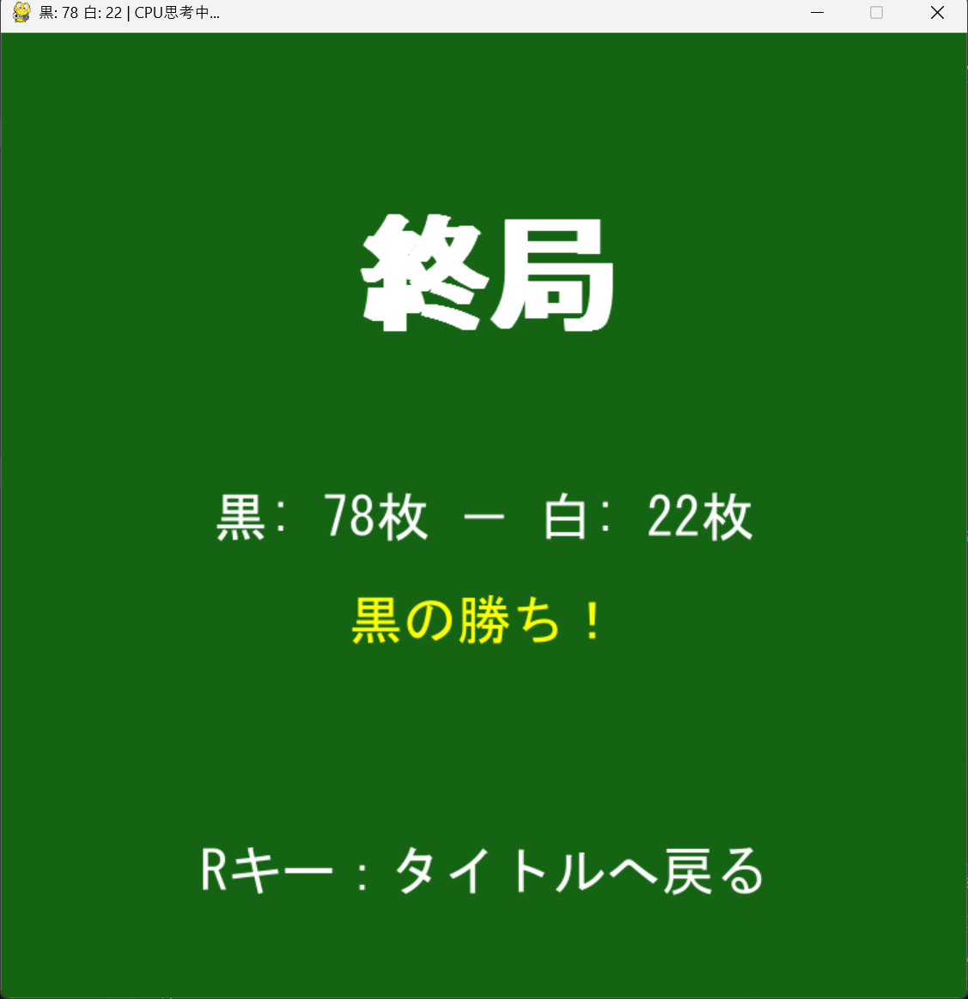

# 10x10 オセロ（カスタム版）

## 概要
PythonのPygameで作成した、通常より広い10x10盤面のオセロゲームです。
CPU対戦機能を搭載し、BGMや効果音による演出にもこだわりました。
.exeファイルのダウンロードは[こちら](https://drive.google.com/file/d/1Qhiyhq0bySYJqFVDWLJTVL-eVaiRthSg/view?usp=drive_link)

制作時期：2026年1月〜2月

## 機能説明
- **10x10盤面**: 通常の8x8よりも戦略性が広がるカスタムサイズ。
- **音声演出**: 石を置く音や対局中のBGMを実装。
- **配布用EXE化**: `PyInstaller`を使用し、アセットを含めて1ファイルで実行可能。

## 遊び方
このゲームはマウスのクリックのみで操作します。

### 1. タイトル画面
ゲームを起動するとタイトル画面が表示されます。
「1」キーで黒（先攻）、「2」キーで白（後攻）を選択して開始します。

<figure>
    
    <figcaption>タイトル画面</figcaption>
</figure>

### 2. ゲーム画面
盤面をクリックして石を置きます。また、初心者でもプレイしやすいように置ける場所には黄色い丸のアシストが表示されます。
<figure>
    
    <figcaption>プレイング画面1</figcaption>
</figure>
また、置ける場所がなくなり手番がパスする場合は、手番がパスになったのを分かりやすくするために下の画像のように『白(または黒)の置ける場所がないため、順番をパスします。』と表示されるようにしました。
<figure>
    
    <figcaption>プレイング画面2</figcaption>
</figure>
<figure>
    
    <figcaption>プレイング画面3</figcaption>
</figure>

### 2. 終了画面
CPUとの対戦結果のリザルトが表示されます。
具体的に説明すると「黒〇〇-白〇〇」と表示されます。
また、枚数が多い方、この場合だと黒が56枚差で勝っているので「黒の勝ち！」と表示されています。
<figure>
    
    <figcaption>終了画面</figcaption>
</figure>
